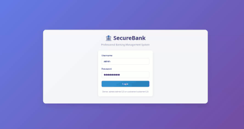

# 💰 Bank Management System


A complete full-stack web application simulating a core banking system with real-world features like role-based access control, secure transactions, and dynamic reporting. Built using Flask for the backend and vanilla JavaScript for a SPA-style frontend.

---

## 🌐 Live Demo & Screenshot



---

## ✨ Features

### 🔐 Role-Based Access Control (RBAC)

* **Admin**: System-wide access and reporting tools.
* **Manager**: Manage customer accounts and process deposits/withdrawals.
* **Customer**: View personal account and initiate transfers.

### 🖥️ Dynamic Frontend

* Built as a Single Page Application (SPA).
* Uses vanilla JavaScript to load views dynamically without full page reloads.

### 🔧 RESTful API Backend

* Flask-based backend exposing REST endpoints.
* Handles all business logic and data transactions securely.

### 💳 Banking Operations

* **Create Accounts** (Managers)
* **Deposit / Withdraw** (Managers)
* **Transfer Funds** (Customers)
* **Dashboard Reports** (Admins & Managers)

### 🗃️ Persistent Storage

* Uses SQLite for reliable and lightweight data storage.
* Includes database schema and initialization scripts.

---

## 🧱 Tech Stack

### Frontend

* HTML5, CSS3, JavaScript (ES6+)

### Backend

* Python 3, Flask, Flask-CORS, Werkzeug

### Database

* SQLite 3

---

## 📁 Project Structure

```
Banking-System/
├── backend/
│   ├── app.py              # Flask app with API endpoints
│   ├── db_utils.py         # DB utility functions
│   ├── init_db.py          # DB initializer script
│   ├── schema.sql          # SQLite DB schema
│   └── requirements.txt    # Python dependencies
├── frontend/
│   ├── index.html          # Entry HTML & login page
│   ├── views/              # HTML partials per view
│   │   ├── dashboard.html
│   │   ├── accounts.html
│   │   └── ...
│   ├── app.js              # SPA controller logic
│   └── styles.css          # Custom CSS
└── README.md               # You're here!
```

---

## 🚀 Getting Started

### Prerequisites

* Python 3.10 or higher
* pip package manager

### Installation

1. **Clone the Repo**

```bash
git clone https://github.com/your-username/banking-System.git
cd banking-System
```

2. **Setup Backend**

```bash
cd backend
pip install -r requirements.txt
python init_db.py  # Initializes bank.db
```

3. **Start the Flask Server**

```bash
python app.py
# Running at http://127.0.0.1:5000
```

4. **Launch Frontend**

* Navigate to `frontend/`
* Open `index.html` in your browser

---

## 🧪 Test Credentials

| Role     | Username | Password    |
| -------- | -------- | ----------- |
| Admin    | admin    | admin123    |
| Manager  | manager  | manager123  |
| Customer | customer | customer123 |

---

## 📡 API Endpoints

| Method | Endpoint                       | Description                         |
| ------ | ------------------------------ | ----------------------------------- |
| POST   | `/api/login`                   | User authentication and role return |
| GET    | `/api/accounts`                | Retrieve all accounts               |
| POST   | `/api/accounts`                | Create new customer account         |
| POST   | `/api/transactions/deposit`    | Deposit funds                       |
| POST   | `/api/transactions/withdraw`   | Withdraw funds                      |
| POST   | `/api/transactions/transfer`   | Transfer between accounts           |
| GET    | `/api/transactions`            | Get all transactions                |
| GET    | `/api/reports/dashboard_stats` | Get stats for dashboard             |
| GET    | `/api/reports/account_summary` | Detailed report of all accounts     |
| GET    | `/api/reports/daily_summary`   | Report of daily transaction totals  |

---

## 🔮 Future Improvements

* [ ] JWT-based Authentication
* [ ] Personalized Customer Dashboards
* [ ] Loan Request & Approval System
* [ ] PostgreSQL integration for production
* [ ] Test Suite (unit/integration)
* [ ] Dockerization for full-stack deployment

---

## 📄 License

This project is licensed under the MIT License. See [LICENSE.md](LICENSE.md) for full details.

---

## 👨‍💻 Author

Made with ❤️ by \[Deekshith]. Feel free to connect and contribute!
=======
